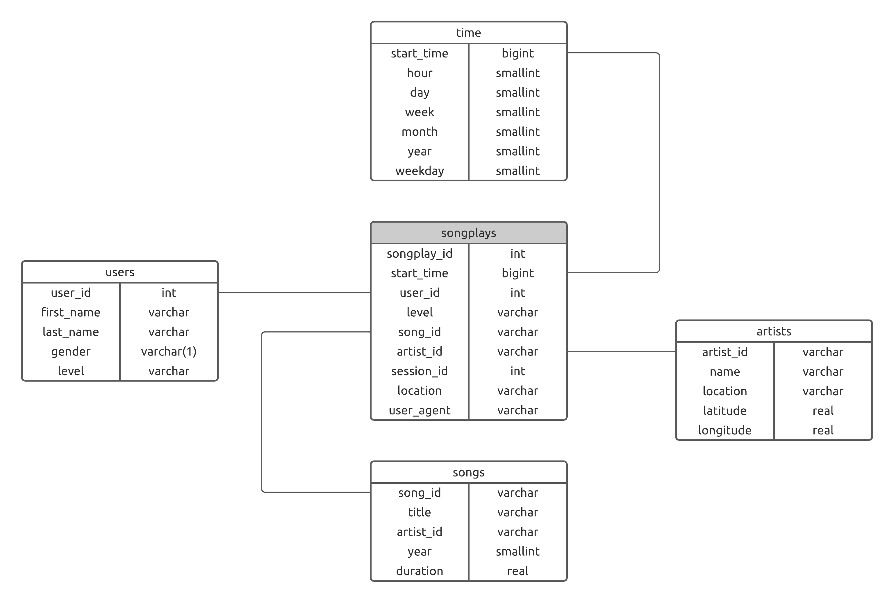

# Sparkify: Data Modeling with Postgres

This project is part of Udacity's **Data Engineering Nanodegree**. 

## Description

This project is an ETL pipeline using Python that helps a fake startup called Sparkify generate the databases required by its analytics team. As this team is particularly interested in understanding what songs users are listening to, the database was designed to allow simple queries and fast aggregations on song reproductions.

## Schema Design

Due to the analytical purposes of this database, the schema was designed to optimize reads and aggregations. More specifically, a [Star Schema](https://en.wikipedia.org/wiki/Star_schema) was utilized. 

The resulting schema was the following:



## ETL Pipeline

The developed pipeline reads the JSON files contained in the `data/log_data` and `data/song_data` directories.

To process a song data file, we use [Pandas](https://pandas.pydata.org/) to read a JSON file and extract the required field for the `songs` and `artists` tables.

The processing of a log file is also performed using [Pandas](https://pandas.pydata.org/) but is a little more difficult as the following steps are required:

1. Creating a dataframe object from the JSON file.
1. Filtering the rows that involve a **Next Song** page.
1. Obtaining the timestamp, hour, day, week, month, year and weekday from the `start time` column.
1. Query the `songs` and `artists` tables to obtain the corresponding `song_id` and `artist_id` as the log files do not include it.
1. Extract and insert the adequate fields into the `songplays` table.

## Creating Databases

### Requirements

#### PosgresSQL

This project uses Postgres as its database engine. The database name, user and password have been hardcoded into the ETL and its creation is taked cared by `create_tables.py`. To use the scripts without alterations you should create a role called *student* with a password of *student*. You can perform this with the following commands:

```
psql postgres
create user student with encrypted password 'student' createdb;
```

Additionaly a database with the name *studentdb* is required. It can be created using the following commands (assuming you continue in the postgres line interface):

```
create database studentdb;
```

#### Python

Python 3.9.4 is required to execute the scripts of this project. The library dependencies (of the whole workspace) have been extacted to the filed called `requirements.txt` and can be installed used the follwing command:

```
pip install -r requirements.txt
```

### Execution

In order to create the databases clone this repo and once you have fullfilled the requirements detailed above run the following commands:

```
python create_tables.py
```

```
python etl.py
```

## Sample Queries

You can test the newly created databases with the following queries.

**What user level is having the most repoductions?**

```sql
SELECT 
    level, COUNT(*) as no_reproductions 
FROM songplays
GROUP BY level
ORDER BY no_reproductions DESC;
```

The results are:

| level | no_reproductions |
|:-----:|:----------------:|
|  paid |       5591       |
|  free |       1229       |

**Which are the top ten locations with the most reproductions?**

```sql
SELECT 
	location, COUNT(*) as no_reproductions 
FROM songplays
GROUP BY location
ORDER BY no_reproductions DESC
LIMIT 10;
```
The results are:

|                 location                | no_reproductions |
|:---------------------------------------:|:----------------:|
|    San Francisco-Oakland-Hayward, CA    |        691       |
|       Portland-South Portland, ME       |        665       |
|         Lansing-East Lansing, MI        |        557       |
|    Chicago-Naperville-Elgin, IL-IN-WI   |        475       |
|    Atlanta-Sandy Springs-Roswell, GA    |        456       |
|         Waterloo-Cedar Falls, IA        |        397       |
|       Lake Havasu City-Kingman, AZ      |        321       |
|   Tampa-St. Petersburg-Clearwater, FL   |        307       |
|    San Jose-Sunnyvale-Santa Clara, CA   |        292       |
| Sacramento--Roseville--Arden-Arcade, CA |        270       |

**What day of the week are we most listened to?**

```sql
SELECT 
	time.weekday,
	COUNT(songplays.songplay_id) as no_reproductions
FROM songplays
JOIN time ON songplays.start_time = time.start_time
GROUP BY time.weekday
ORDER BY no_reproductions DESC;
```

The results are:

| weekday | no_reproductions |
|:-------:|:----------------:|
|    2    |       1370       |
|    4    |       1297       |
|    1    |       1073       |
|    3    |       1054       |
|    0    |       1014       |
|    5    |        630       |
|    6    |        396       |

## Project Structure

```
├── README.md                                  <- The top-level README for developers using this project.
├── data                                       <- Directory for log and song JSON files
│   ├── log_data                               <- Logs JSON files                                 
│   └── song_data                              <- Songs JSON files 
├── create_tables.py                           <- Python script responsible for creating the db and the schema
├── etl.ipynb                                  <- Jupyter Notebook used to design the ETL process
├── etl.py                                     <- Python script responsible of populating the db
├── requirements.txt                           <- Library dependencies needed for the pipeline
├── sparkify-schema.png                        <- Schema image used in README.md
├── sql_queries.py                             <- Contains all the SQL statments used by the pipeline
└── test.ipynb                                 <- Jupyter notebook used for testing purposes
```